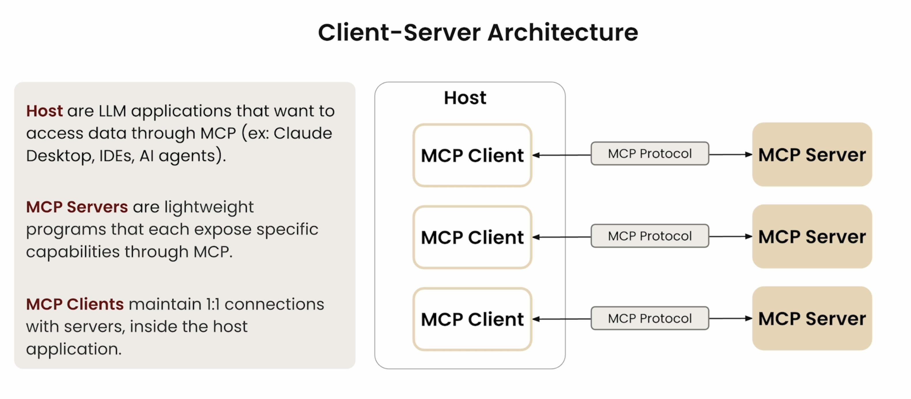
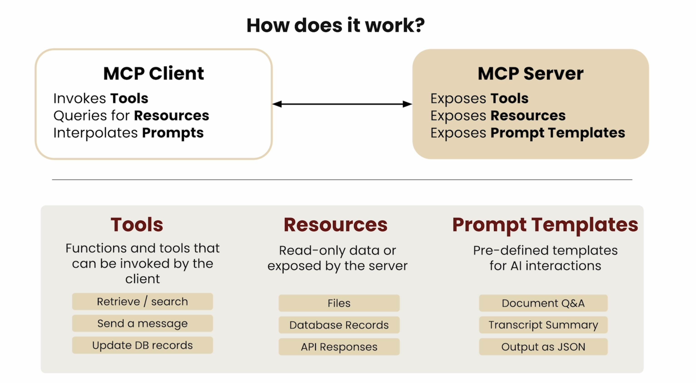
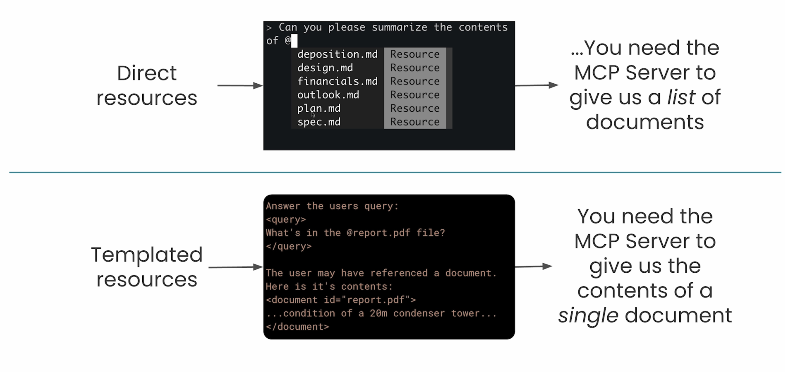
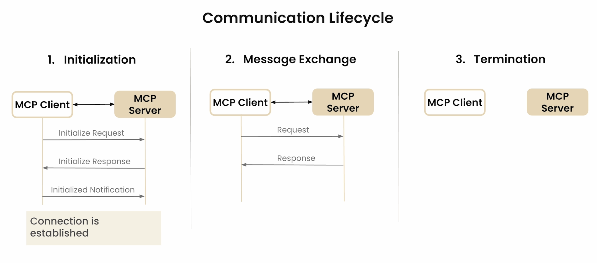
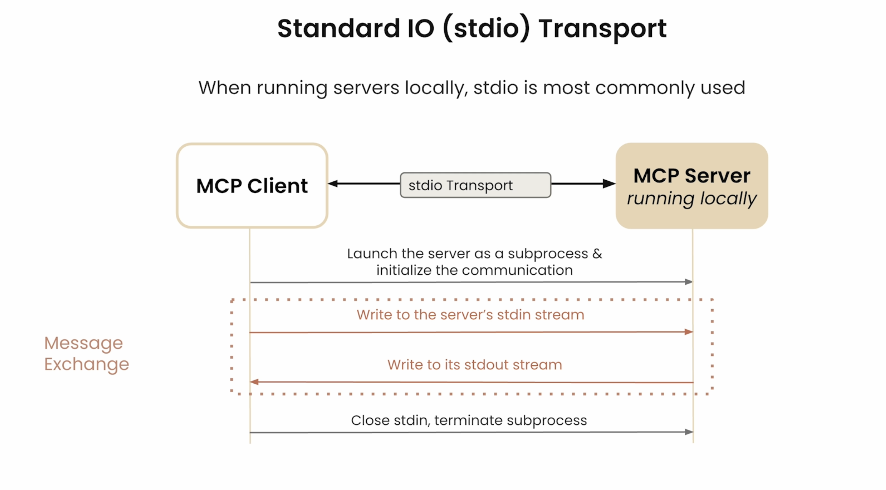
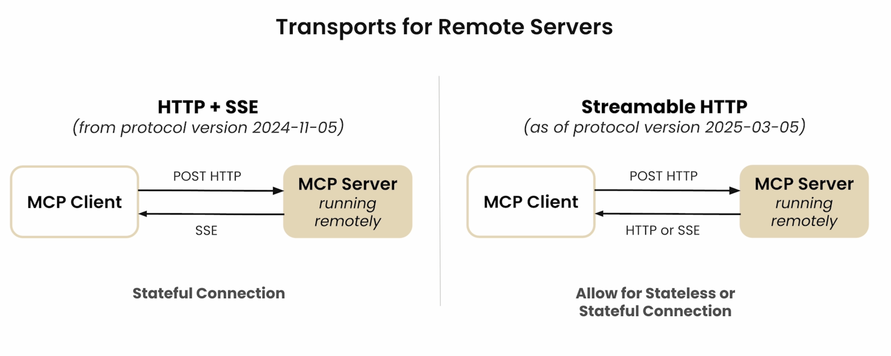
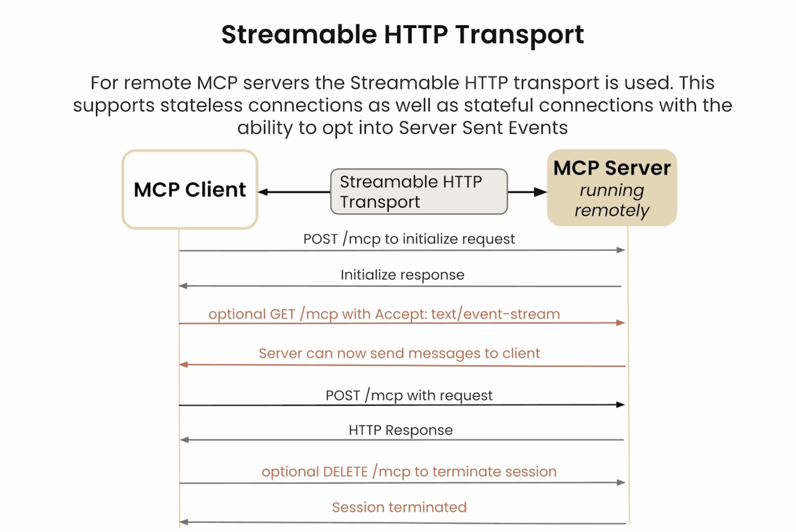

## Model Context Protocols

&nbsp;

### Basic Understanding

**Definition:** MCP is an open protocol that standardizes how your **LLM applications** connect to and work with your **tools & data sources.**

> So the idea here is not to reinvent the wheel like how we use tools etc, but to standardize the way our AI Applications connect with data sources.

**Other previously existing concepts:**
- **REST APIs:** Standardizes how **web applications** interact with the **backend**.
- **LSP(Language Server protocol):** Standardizes how **IDEs** interact with language specific tools.

- **MCP:** Standardizes how **AI applications** interact with **external systems**.

> Interestingly, **anything that can be done using MCP can also be done without MCP**. The only aim of this to have a common umbrella (we use the word 'standarize') for our AI Applications to interact with external sources.

> So intead of creating different connections each time to different sources from our application (like how we did with APIs), we build this i.e. MCP once and connect anywhere.

**How is using an MCP Server different from just calling a service's API directly?**

MCP Servers do seem every similar to working with APIs (and that's not totally wrong if you think about it). We can instead see it as a gateway/wrapper that is built on top of an API. So if you don't want to bother calling the API directly, you can just ask in natural language and the MCP server will handle that for you.

**Sounds like MCP Servers and tool use are the same thing?**

MCP Servers provide tool schemas + functions already defined for you.

&nbsp;

### MCP Architecture

MCP is essentially a Client-Server Architecture. The following two slides from DeepLearning.AI course show this well.

<div align="center">

</div>

<div align="center">

</div>

In the latter image above we can see three different functionalities which MCP offers: Tools, Resources and Prompt Templates. So how do we utilize them?

1. **Defining a Tool**
    - MCP provides SDK's for building servers and clients in a variety of languages.
    - One such is Python MCP SDK, it makes it very easy to declare tools.

**Code that can be written in the MCP Server:**

```
@mcp.tool()
def add(a: int, b:int) -> int:
    """
    Args:
        a: First number to add
        b: Second number to add

    Returns:
        The sum of the two numbers
    """
    return a + b
```

2. **Resources**
    - Allow MCP Server to expose data to the client (These are similar to GET request handler in a typical HTTP server).
    - There are two types: **Direct and Templated**.
    - Can return any type of data including Strings, JSON, Binary etc. For example: We set `mime_type` to give the client a hint as to what data will be returned.

**Code that can be written in the MCP Server:**

Direct Resource:
```
@mcp.resource(
    "docs://documents",
    mime_type="application/json"
)
def list_docs():
    # Return list of document names
```

Templated:
```
@mcp.resource(
    "docs://documents/{doc_id},
    mime_type="text/plain"
)
def fetch_doc(doc_id: str):
    # Return contents of a doc
```

Below shows the two ways. In direct we specifically chose the file we need via `@`, but in template we simply mention it as part of the prompt and it is sent to the client. The application then decides whether it needs to take that data or not (Rather than having a tool call first to take the data, then pass to prompt and then send).

<div align="center">

</div>

3. **Prompts**
    - Defines a set of messages which can be used by the client. These should be of high quality and must be well tested.

**Code that can be written in the MCP Server:**

```
@mcp.prompt(
    name:"format"
    description:"Rewrites contents of a document in Markdown format",
)
def format_document(doc_id: str) -> list[base.Message]:
    # Return a list of messages
```

&nbsp;

### Communication in MCP

The image below depicts the typical communication lifecycle between MCP servers and clients.

<div align="center">

</div>

It's important to understand the steps here as these will be seen in code as well.
- In Step 1 there is initialization from both ends and finally ending in notification of approval.
- In Step 2, although its not seen in the image, there is communication on both ways (between Server and Client) and there is also two way notification approvals between them as well.
- Finally, Step 3 is where the termination of this entire lifecycle happens.

**How are the messages being sent and recieved between the client and server? - MCP Transports**

A transport handles the underlying mechanics of how messages are sent and received between the client and server.

There are types for this as well depending on where the servers are running:
- Local servers: `stdio`
- Remote servers: `HTTP+SSE (Server Sent Events)` or `Streamable HTTP`.

> Streamable HTTP will be the standard protocol which will be used going forward as stateless connection are much preferred.

<div align="center">

</div>

<div align="center">

</div>

<div align="center">

</div>